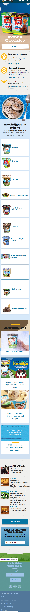
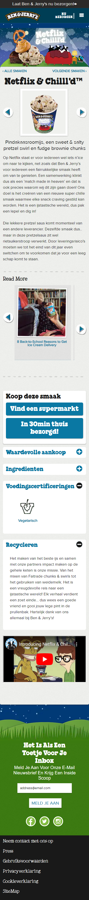
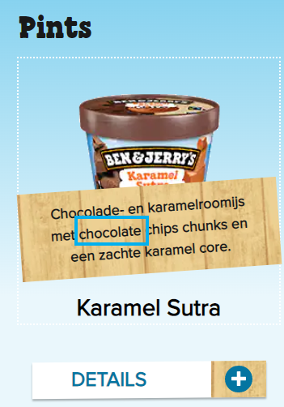

# Procesverslag

Markdown is een simpele manier om HTML te schrijven.  
Markdown cheat cheet: [Hulp bij het schrijven van Markdown](https://github.com/adam-p/markdown-here/wiki/Markdown-Cheatsheet).

Nb. Door _open_ toe te voegen aan een _details_ element kun je deze standaard open zetten. Fijn om dat steeds voor de relevante stuk(ken) te doen.

## Jij

  
uitwerken voor kick-off werkgroep

### Auteur:

  Diem Do

#### Je startniveau:

  Blauw

#### Je focus:

  Responsive

## Je website

  
uitwerken voor kick-off werkgroep

### Je opdracht:

(https://www.benjerry.nl/)

#### Screenshot(s) van de eerste pagina (small screen):

  Homepagina Ben & Jerry mobiel weergave
  

#### Screenshot(s) van de tweede pagina (small screen):

  Detail pagina Ijsmaak Netflix & Chill'd mobiel weergave
  

## Toegankelijkheidstest 1/2 (week 1)

  
uitwerken na test in 1e werkgroep

### Bevindingen

  Lijst met je bevindingen die in de test naar voren kwamen:

#### Screenreader

Windows Narrator laat het website meerdere keren crashen: 5x in totaal.
Leest de Ben&Jerry logo in de hoofdnavigatie balk als "homepagina"

Kan van uit de hoofdnavigatie niet tussen de menu items navigeren zonder een muis.
Kan ook met toetsenbord maar dan zou je door alle subitems moeten gaan.

Gebruik de optie om alle headings
voor te laten lezen. Is de structuur
logisch?
- Structuur is logisch

Gebruik de optie om alle linkjes voor
te laten lezen. Is het duidelijk wat de
linkjes doen?
- Het is duidelijk hoe elk koppeling heet, maar niet altijd duidelijk waar het heen gaat.

Na 4x klikken krijg je pas te horen wat de smaak Karamel Sutra inhoudt.

#### Muis en Toetsenbord

  Hier korte omschrijving (met indien nodig afbeeldingen)

  Hier een omschrijving van hoe het opgelost kan worden (met indien nodig afbeeldingen)

#### Motoriek (shocks, elastiekjes)

  Hier korte omschrijving (met indien nodig afbeeldingen)

  Hier een omschrijving van hoe het opgelost kan worden (met indien nodig afbeeldingen)

#### Visueel (brillen, contrast, kleurenblind, dark/light).

  Hier korte omschrijving (met indien nodig afbeeldingen)

  Hier een omschrijving van hoe het opgelost kan worden (met indien nodig afbeeldingen)

## Breakdownschets (week 1)

  
uitwerken na afloop 2e werkgroep

### de hele pagina:

  

### dynamisch deel (bijv menu):

  

### wellicht nog een dynamisch deel (bijv filter):

  

## Voortgang 1 (week 2)

  
uitwerken voor 1e voortgang

### Stand van zaken

  hier dit ging goed & dit was lastig (neem ook screenshots op van delen van je website en code)

### Agenda voor meeting

  samen met je groepje opstellen

| student 1      | student 2          | student 3    | student 4        |
| -------------- | ------------------ | ------------ | ---------------- |
| dit bespreken  | en dit             | en ik dit    | en dan ik dat    |
| en dat ook nog | dit als er tijd is | nog een punt | dit wil ik zeker |
| ...            | ...                | ...          | ...              |

### Verslag van meeting

  hier na afloop snel de uitkomsten van de meeting vastleggen

-   punt 1
-   punt 2
-   nog een punt
-   ...

## Voortgang 2 (week 3)

  
uitwerken voor 2e voortgang

### Stand van zaken

  hier dit ging goed & dit was lastig (neem ook screenshots op van delen van je website en code)

### Agenda voor meeting

  samen met je groepje opstellen

| student 1      | student 2          | student 3    | student 4        |
| -------------- | ------------------ | ------------ | ---------------- |
| dit bespreken  | en dit             | en ik dit    | en dan ik dat    |
| en dat ook nog | dit als er tijd is | nog een punt | dit wil ik zeker |
| ...            | ...                | ...          | ...              |

### Verslag van meeting

  hier na afloop snel de uitkomsten van de meeting vastleggen

-   punt 1
-   punt 2
-   nog een punt
-   ...

## Toegankelijkheidstest 2/2 (week 4)

  
uitwerken na test in 8e werkgroep

### Bevindingen

  Lijst met je bevindingen die in de test naar voren kwamen (geef ook aan wat er verbeterd is):

#### Screenreader

  Hier korte omschrijving (met indien nodig afbeeldingen)

  Hier een omschrijving van hoe het opgelost kan worden (met indien nodig afbeeldingen)

#### Muis en Toetsenbord

  Hier korte omschrijving (met indien nodig afbeeldingen)

  Hier een omschrijving van hoe het opgelost kan worden (met indien nodig afbeeldingen)

#### Motoriek (shocks, elastiekjes)

  Hier korte omschrijving (met indien nodig afbeeldingen)

  Hier een omschrijving van hoe het opgelost kan worden (met indien nodig afbeeldingen)

#### Visueel (brillen, contrast, kleurenblind, dark/light).

  Hier korte omschrijving (met indien nodig afbeeldingen)

  Hier een omschrijving van hoe het opgelost kan worden (met indien nodig afbeeldingen)

## Voortgang 3 (week 4)

  
uitwerken voor 3e voortgang

### Stand van zaken

  hier dit ging goed & dit was lastig (neem ook screenshots op van delen van je website en code)

### Agenda voor meeting

  samen met je groepje opstellen

| student 1      | student 2          | student 3    | student 4        |
| -------------- | ------------------ | ------------ | ---------------- |
| dit bespreken  | en dit             | en ik dit    | en dan ik dat    |
| en dat ook nog | dit als er tijd is | nog een punt | dit wil ik zeker |
| ...            | ...                | ...          | ...              |

### Verslag van meeting

  hier na afloop snel de uitkomsten van de meeting vastleggen

-   punt 1
-   punt 2
-   nog een punt
-   ...

## Eindgesprek (week 5)

  
uitwerken voor eindgesprek

### Je uitkomst - karakteristiek screenshots:

  

### Dit ging goed/Heb ik geleerd:

  Korte omschrijving met plaatjes

  

### Dit was lastig/Is niet gelukt:

  Korte omschrijving met plaatjes

  

## Bronnenlijst

  
continu bijhouden terwijl je werkt

  Nb. Wees specifiek ('css-tricks' als bron is bijv. niet specifiek genoeg).

1.  bron 1
2.  bron 2
3.  ...

